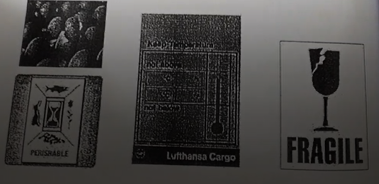

### 4.1 Hàng do đại lý/ người gửi chất xếp lên ULD(Bulk Unitization Program - BUP)

- Một số khách hàng thường xuyên có sức mua mạnh được nhà vận chuyển
  lựa chọn bán chỗ nguyên ULD và giao cho họ tự chất xếp hàng lên ULD
  sau khi nhân viên của họ đã được đào tạo theo yêu cầu
- Nhân viên nhà ga hàng hóa không được nhận các ULD do đại lý, người gửi hàng chất hàng nguy hiểm(DG)
  trừ các trường hợp ngoại lệ được quy định tại DGR 9.1.4(Acceptance of Freight containers and Unit Load Devices)
  và trên nhãn ULD phải được ghi rõ ràng là hàng BUP

### 4.2 Túi thư ngoại giao(DIP)

- Túi thư ngoại giao do các Cơ quan ngoại giao(Sở ngoại vụ, Đại sứ quán, Lãnh sự quán,
  Văn phòng đại diện cơ quan ngoại giao các nước,...) trực tiếp đến nhà ga hàng hóa để gửi
  (sau khi đã được hãng hàng không giữ chỗ) hoặc nhận
- Trên túi thư ngoại giao ngoài nhận hàng hóa thông thường có số AWB, còn được gắn thẻ
  có ghi ký hiệu DIP
  **Những đặc điểm cần lưu ý khi chất xếp túi thư ngoại giao:**
- Không chất xếp cùng chất phóng xạ hay hàng mang từ tính trên cùng hầm
- Đặc biệt cần phân biệt giữa "túi thư ngoại giao" (DIP mail) và hàng ngoại giao(DIP Cargo)
  hàng ngoại giao được phục vụ như hàng thông thường
- Túi thư ngoại giao cần lưu giữ ở khu vực có kiểm soát an ninh
- Nếu xảy ra tổn thất cho túi thư/ hàng ngoại giao đến của Lãnh sự quán hay Cơ quan đại diện ngoại giao:
  - Phải báo ngay cho Cơ quan đại diện ngoại giao gần nhất và chỉ gửi đi sau khi đã đóng gói và niêm phong lại
  - Nếu không có Cơ quan đại diện ngoại giao tại khu vực: túi thư phải được lưu giữ ở khu vực có kiểm soát an ninh;
    toàn bộ túi thư phải được cân và niêm phong lại, trọng lượng và số niêm phong phải được ghi lại trên AWB lập
    biên bản bất thường
- Trường hợp túi thư ngoại giao gửi đi bị chậm trễ hay tổn thất:
  - Phải gửi đi ngày và
  - Lập biên bản bất thường trong trường hợp bị tổn thất

### 4.3 Hàng giá trị cao(Valuable Cargo - VAL)

#### 4.3.1 Hàng giá trị cao là hàng có một hoặc nhiều dạng sau:

- Bất kỳ hàng nào có giá trị trên kê khai vận chuyển từ USD 1000/kg(kể cả trọng lượng bao bì) trở lên
- Vàng nén(bao gồm cả vàng tho và vàng tinh chế ở dạng thỏi), tiền đồng vàng, vàng ở dạng hạt, tấm, lá,
  bột, bọt, dây, que, ống, vòng, đúc, khuôn đúc
- Platinum, nhóm Platinum kim loại(Palladium, iridium, ruthenium, osrnium và rhodium) và hợp kim platinum
  ở dạng hạt, bọt, thanh, thỏi, tấm, que, dây, lưới min, ống, dải(ngoại trừ những đồng vị phóng xạ của những
  kim loại và hợp kim này)
- Tiền giấy, sec du lịch, chứng khoán, cổ phiếu, thẻ tín dụng
- Kim cương(bao gồm kim cương sử dụng trong công nghiệp), ruby, emerald(đá ngọc lục bảo), sapphire, opal và
  ngọc trai(bao gồm ngọc trai nuôi cấy)
- Đồ trang sức và đồng hồ làm từ bạc và/ hoặc vàng và/ hoặc platinum
- Những vật phẩm làm từ vàng và/ hoặc platinum

#### 4.3.2 Yêu cầu phục vụ

- Hàng hóa có giá trị cao hơn USD 5000/kg thường được nhà vận chuyển bảo hiểm riêng
- Trong quá trình giao nhận phải kiểm kỹ và lập biên bản giao nhận đầy đủ
- Kiện hàng không cần dãn nhãn, có thể dùng thẻ(tag) hoặc viết tay lên kiện hàng ký ký hiệu VAL.
  Trên nhãn ULD(tag) sử dụng ký hiệu(code) riêng do nhà vận chuyển quy định
- Các kiện nhỏ được chất vào túi VAL có niêm phong, lưu giữ tại khu vực có kiểm soát an ninh chặt chẽ(Strong room)
- Không được phép gửi theo đường bộ(RFS: Road Feeder Service)
- Nếu mất mát thất lạc phải báo ngay cho Cán bộ trực

### 4.4 Hàng dễ bị mất mát(Vulnerable Cargo - VUN)

- Hàng dễ bị mất mát có giá trị thấp hơn hàng VAL, thường ở dạng thành phẩm, kích thước nhỏ
  dễ bị mất mát. Ví dụ: máy tính bảng, điện thoại di động, bút máy Parker, gọng kính Titan,...
  **Yêu cầu phục vụ:**
- Khi tiếp nhận phải kiểm tra kỹ bao bì, đối chiếu với tờ khai hải quan để biết nội dung nếu cần
- Hàng phải được lữu giữ tại kho VUN
- Trong quá trình chất xếp, bốc dỡ hàng phải chú ý nhẹ tay
- Nếu kiện hàng được dán nhãn phục vụ như: nhãn hàng dễ vỡ, nhãn tránh để hàng nơi ẩm ướt, nhãn tránh ánh nắng mặt trời
  nhãn mũi tên chỉ hướng, không được phép chất trồng lên,..., khi phục vụ phải tuân thủ các yêu cầu này

### 4.5 Báo, tạp chí(Newspaper, magazine - NWP)

- Báo và tạp chí có tính thời sự cao, phục vụ việc cập nhật thông tin, do vậy báo và tạp chí
  được ưu tiên trong vận chuyển
- Trong kiện hàng báo, tạp chí có thể có các băng, đĩa từ, vì vậy khi chất xếp phải lưu ý
  không chất gần hàng có từ tính(MAG)

### 4.6 Phim chưa tráng(Undeveloped films - FIL)

- Các kiện hàng chứa phim chưa tráng phải được chất cách ly với hàng phóng xạ nhằm trách gây
  hư hỏng phim

### 4.7 Thi hài trong quan tài(Human Remains in coffin - HUM)

- Thi hài phải được đặt trong một quan tài bằng kẽm hoặc chì, sau đó được đặt trong một quan tài bằng
  gỗ hay kim loại. Ngoài cùng được che phủ bằng tấm vải bạt hoặc vải dầu nhằm không để lộ rõ quan tài
- Việc phục vụ, chất xếp quan tài phải luôn được tôn trọng. Quan tài luôn được chất xếp theo phương nằm ngang
  không được chất xếp quan tài gần thực phẩm(EAT) và chó, mèo. Cần tham chiếu bảng chỉ dẫn chất xếp cách ly
- Riêng hãng LH cho phép chất các kiện hàng khác lên trên quan tài, tuy nhiên không được phép chất hàng nặng
- Ký hiệu HUM không áp dụng đối với hũ tro cốt

### 4.8 Hàng dễ hư hỏng(Perishable Cargo - PER)

- Hàng dễ hư hỏng là loại hàng do tính chất và đặc tính của nó đòi hỏi quá trình chất xếp, lưu kho, vận chuyển
  phải tuân thủ các yêu cầu riêng nhằm đảm bảo hàng hóa không bị hư hỏng do tác động của nhiệt độ, độ ẩm
  và thời gian phục vụ
- Hàng dễ hư hỏng gồm các dạng sau đây:

  | Ký hiệu(Code) | Mô tả nội dung                                                                                                                       |
  | ------------- | ------------------------------------------------------------------------------------------------------------------------------------ |
  | ACT           | Hàng được vận chuyển trong thùng(container) có thể thống kiểm soát nhiệt độ - Thùng lạnh chủ động(Active temperature control system) |
  | COL           | Hàng dễ hư hỏng yêu cầu được giữ nhiệt độ mát khi vận chuyển, lưu kho(Cool Goods)                                                    |
  | EAT           | Thực phẩm(ngoại trừ thịt, cá, hải sản)                                                                                               |
  | FRI           | Hàng động lạnh qua kiểm dịch thực vật - thú y(Frozen Goods subject to veterinary/ phytosanitary inspection)                          |
  | FRO           | Hàng đông lạnh(Frozen goods)                                                                                                         |
  | HEG           | Trứng hấp(Hatching Eggs)                                                                                                             |
  | LHO           | Máu tươi, có quan nội tạng con người(Live Human Organs/Blood)                                                                        |
  | PEA           | Các sản phẩm bắt nguồn từ động vật được liệt kê trong danh mục của CITES(sản phẩm săn bắn, dã thú...)                                |
  | PEF           | Thực vật hoa tươi                                                                                                                    |
  | PEM           | Thịt                                                                                                                                 |
  | PEP           | Rau quả                                                                                                                              |
  | PER           | Hàng dễ hư hỏng(Nói chung)                                                                                                           |
  | PES           | Cá, hải sản tươi                                                                                                                     |
  | PIL           | Dược phẩm cần kiểm soát nhiệt độ                                                                                                     |

  **Yêu cầu phục vụ:**

- Quá trình chất xếp lưu kho hàng dễ hư hỏng cần tham chiếu bảng chỉ dất chất xếp cách ly
- Kho hàng phải được dán nhãn "Perishable", "Keep temperature", "Fragile", "This Way Up"
- Trường hợp phải chất xếp các kiện hàng chồng lên nhau, phải đảm bảo các kiện hàng bên dưới không bị hư hại (tránh chất mâm cao, bé)
- Đối với các kiện hàng có rò rỉ chất lỏng, phải phục vụ như hàng ươt(WET)
- Không được phủ kín các mâm rau quả bằng tấm nylon(trừ khi người gửi hàng yêu cầu)
- Khi chất xếp các kiện hàng rau, quả phải đảm bảo khoảng trống lưu thông không khí giữa các kiện hàng

### 4.9 Trứng hấp(Hatching eggs - HEG)

- Yêu cầu phục vụ: Trứng hấp(hatching eggs) là trứng có chứa phôi sống và đang trong quá trình ấp. Do vậy trong quá trình
  phục vụ chất xếp, lưu kho kiện hàng trứng ấp phải được:
  - Dán nhãn **Perishable**, **Keep temperature**, **Fragile**
  - Tham chiếu bảng chỉ dẫn chất xếp cách ly
  - Không để kiện hàng trức tiếp dưới ánh nắng trực tiếp dưới ánh nắng hoặc nhiệt độ cao

### 4.10 Động vật sống(Live Animals - AVI)

- Việc vận chuyển động vật sống phải tuân thủ quy định vận chuyển động vật sống của IATA(IATA Live Animals Regulations)
- Khi tiếp nhận động vật sống để vận chuyển phải sử dụng **Phiếu kiểm tra tiếp nhận động vật sống**(IATA Live Animals Acceptance Chekced)
- Kiện hàng động vật sống thường được dán các nhãn **Live Animal**, **Keep temperature**, **This way up**, **Handling Instructions**, trong quá trình phục vụ phải tuân thủ các chỉ dẫn theo yêu cầu
- **Yêu cầu phục vụ:**
  - Quá trình chất xếp lưu kho động vật sống cần tham chiếu bảng chỉ dẫn chất xếp cách ly
  - Động vật sống không được chất xếp vào thùng(container) kín, ngoại trừ cá và các loại sống trong môi trường nước
  - Động vật sống phải được chất xếp giữ khoảng cách với các kiện hàng khác đảm bảo lưu thông dưỡng khí
  - Thông tin về động vật sống trên NOTOC(Special Load - Notification to Captain) phải bao gồm các yêu cầu về kiểm soát nhiệt độ và điều kiện thông hơi trên hầm hàng
  - Động vật sống cũng phải được phục vụ như hàng ướt(Wet Cargo). Bên dưới kiện hàng phải được lót tấm nylon và vật liệu thấm hút(như giấy thấm, mùn cửa,...) đảm bảo không để chất lỏng rò rỉ ra sàn ULD, sàn mâm hàng và gây hư hỏng các kiện hàng khác. Tránh sử dụng cỏ khô hoặc rơm làm vật liệu thấm hút do đặc điểm dễ bắt cháy và quy định kiểm dịch của một số quốc gia
  - Những động vật đố kỵ nhau trong tự nhiên không được phép chất xếp cạnh nhau
  - Chỉ cho thú ăn theo đúng yêu cầu và chỉ dẫn của người gửi hàng

### 4.11 Hàng ướt(Wet Cargo - WET)

- Các kiện hàng có chứa chất lỏng hoặc do bản chất sản sinh ra chất lỏng và không thuộc đối tượng trong Quy định về hàng nguy hiểm của IATA được xem là hàng ướt (Wet Cargo)
- Ví dụ:
  - Hàng hóa là chất lỏng được đóng bao bì trong các thùng kín nước
  - Cá, hải sản, ướp đá, thịt tươi, thịt đông lạnh, da chưa thuộc...động vật sống
- Nhằm bảo vệ sàn máy bay, sàn ULD không bị hư hỏng, phải sử dụng tấm nylon hoặc vải dầu trải lên bề mặt sàn máy báy, sàn ULD, các cạnh tấm nylon hoặc vải dầu phải tựa sát vào vách/ tường hầm hàng máy bay/ ULD tạo thành bể chứa chất lỏng rò rỉ, tràn đổ từ kiện hàng
- Đối với các sản phẩm ướp muối(salied casings):
  - Phải được đóng bao bì trong các hộp thiếc kín, chống rỏ rì, các hộp này được đăt trong túi nhựa và miệng túi được buộc chặt. Sau đó đặt vào các khay chứa, đáy khay phủ lớp giấy thấm khoảng 5 cm
  - Luôn chất xếp theo đúng chiều mũi tên chỉ hướng, không để nghiêng
  - Các khay và thùng chứa phải được neo giữ, rằng buộc cẩn thận, chắc chắn
  - Áp dụng mọi biện pháp tránh rỏ rỉ, gây bẩn ra sản phẩm hàng máy bay

### 4.12 Hàng nặng(Heavy Cargo - HEA)

- Một kiện hàng có trọng lượng từ 150kg/330lb trở lên được xem là hàng nặng
- <u> **Yêu cầu phục vụ:** </u>
- Nên chất xếp hàng lên mâm, tránh phải chất xếp kiện hàng vào container LD3, đặc biệt đối với các container chuyên dụng RAP/RKN/HMA/HMU để không gây hư hỏng container, trừ khi có yêu cầu xác nhận từ Hãng vận chuyển
- Kiện hàng cần được neo giữ riêng, trường hợp phải neo giữ chung với các kiện hàng khác phải tuân thủ theo yêu cầu, quy định của nhà vận chuyển
- Kiện hàng nên được chất vào vị trí giữa ULD
- Trường hợp kiện hàng được chất xêp trên khoang chất xá của máy bay(bulk compartment), phải chuẩn bị ván lót chia tải và dụng cụ neo giữ kiện hàng đúng theo quy định
- Khi neo giữ kiện hàng, nên ràng dây lên bên ngoài bao bì kiện hàng, tránh ràng dây trực tiếp lên hàng hóa. Vì vậy, nếu bao bì bị hư hỏng hoặc không đủ bền vững chưa nội dung hàng hóa bên trong thì phải được sửa chưa hoặc thay thể trước khi tiếp nhận để chất xếp

### 4.13 Hàng quá khổ, cồng kềnh(Bulky Cargo - BIG)

- Hàng quá khổ là hàng khi chất xếp cần hơn một ULD, hơn một vị trí chất xếp trên máy bay, hay là hàng hóa cần phải phục vụ đặc biệt khi xếp và dỡ hàng do kích thước quá lớn. Khi chất xếp hàng quá khổ phải tuân thủ chỉ dẫn chất xếp của Hãng vận chuyển
- Hàng quá khổ chỉ được phép vận tiếp nhận và gửi đi khi đã được giữ chỗ hay đã có phép của nhà vận chuyển

### 4.14 Thiết bị, phụ từng máy bay(Aircraft On Ground - AOG)

- Kiện hàng chứa thiết bị phụ tùng máy bay luôn được nhà vận chuyển ưu tiên chuyên chở nhằm phục vụ cho việc sửa chữa bảo trì máy bay đang bị hư hỏng kỹ thuật tại một sân bay nào đó
- Trên kiện hàng được gắn nhãn AOG. Khi nhận chuyên chở kiện hàng AOG, nhà vận chuyển phải tuân thủ quy định vận chuyển hàng nguy hiểm của IATA

### 4.15 Sản phẩm chăm sóc sức khỏe dễ bị tác động bởi thời gian và nhiệt độ(T&T Cargo shipment)

- Sản phẩm chăm sóc sức khỏe là tất cả các sản phẩm thuốc hoặc các chất bao gồm nhưng không giới hạn - nguyên liệu, thành phần hoạt dược chính - Active Pharmaceutical Ingredients(API), tả dược, thiết bị ý tế, các sản phẩm sinh học, huyết tương, nguyên liệu thử nghiệm lâm sàn hoặc bất kỳ một sản phẩm nào được người gửi xác định là sản phẩm chăm sóc sức khỏe, cũng như dễ bị **tác động bởi nhiệt độ** tại thời điểm giao hàng
- Công tác phục vụ phải tuân thủ theo yêu cầu trong Quy định phục vụ hàng hóa cần kiểm soát nhiệt độ của IATA(IATA Temperature Control Regulations - TCR) và yêu cầu của tiêu chuẩn CEIV - Pharma mà SCSC đang áp dụng
- <u> **Yêu cầu phục vụ** </u>
  - Cơ sở hạ tầng, trang thiết bị phải đáp ứng yêu cầu tiêu chuẩn
  - Tuẩn thủ công tác vệ sinh và kiểm soát thực hiện vệ sinh tại khu vực khai thác, trang thiết bị khai thác, kho lưu trữ
  - Lưu trữ đúng nhiệt độ yêu cầu trên MAWB
  - Kiểm soát các chỉ số(KPIs) về thời gian phục vụ, di chuyển, giao nhận
  - Kiểm soát đảm bảo an ninh
  - Thực hiện nghiêm túc công tác kiểm tra đánh giá định kỳ, đột xuất
- Sẽ được huấn luyện chi tiết trong khóa học về Khai thác hàng hóa cần kiểm soát nhiệt độ

### 4.16 Hàng hóa hoặc thư tín có độ rủi ro cao - HRCM

- Các lô hàng có nguồn gốc hoặc chiếp tiếp từ các Quốc gia/ Khu vực do liên minh Châu Âu xác định là có nguy cơ rủi ro cao - Những nước trong danh sách đỏ(Red Contries List)
- Hàng hóa có dấu hiệu bị xâm phạm, giả mạo, không có thông tin rõ ràng và/ hoặc có bất kỳ hư hại, lỗ thủng của bao bì đóng gói đủ lớn để có thể đưa thêm một vật thể lạ từ ngoài vào bên trong kiện hàng(khoảng 10x3cm) được coi là hàng hóa/ thư tín có độ rủi ro cao(HRCM)
- <u> **Yêu cầu phục vụ:** </u>Tuẩn thủ tuyệt đối yêu cầu của RA3 và TSA bao gồm nhưng không giới hạn về:
  - Nhận dạng, xác định HRCM
  - Đáp ứng các yêu cầu về tiêu chuẩn kỹ thuật, xuất xứ, hiệu chuẩn máy soi chiếu, an ninh hàng hóa
  - Tuân thủ các quy định, quy trình kiểm tra, soi chiếu, giám sát an ninh hàng hóa chuyên biệt,...

### 4.17 Hàng nguy hiểm(Dangerous Goods)

- Sẽ được huấn luyện trong khóa học về Hàng nguy hiểm theo quy định của IATA
